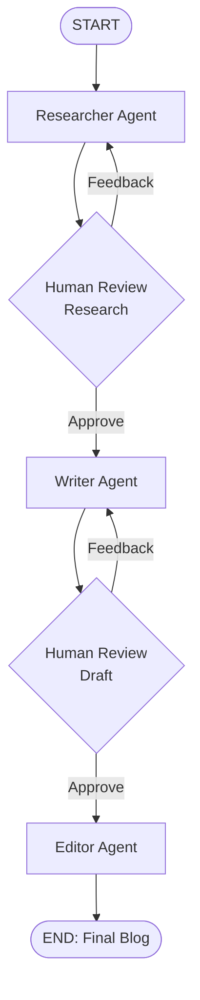

<<<<<<< HEAD
# Multi-Agent Blog Generator

A human-in-the-loop, multi-agent system that researches, writes, and edits complete blog posts. Built with **LangGraph**, **LangChain**, and **Groq**.


---

## Table of Contents

- [Overview](#overview)
- [Key Features](#key-features)
- [Workflow Architecture](#workflow-architecture)
- [Agents](#agents)
- [Human-in-the-Loop Design](#human-in-the-loop-design)
- [Tech Stack](#tech-stack)
- [Project Structure](#project-structure)
- [Getting Started](#getting-started)
- [Usage](#usage)
- [Shared State](#shared-state)
- [Design Decisions & Limitations](#design-decisions--limitations)
- [Roadmap](#roadmap)
- [Author](#author)

---

## Overview

Fully automated content pipelines often produce blogs that are generic or factually off, with no chance for a human to steer them. This project takes a different approach: three specialized agents handle the heavy lifting, while a human reviewer approves the work at two key checkpoints before the process moves on.

```
Researcher Agent → Human Review → Writer Agent → Human Review → Editor Agent → Final Blog
```

The user provides a **topic** and a **target audience**. The system returns a publish-ready blog, with human feedback shaping both the research and the draft along the way.

## Key Features

- **Multi-agent pipeline**: separate Researcher, Writer, and Editor agents, each with a focused responsibility
- **Two human review gates**: approve or send feedback after research and again after the draft
- **Feedback-driven revision loops**: rejected research goes back to the Researcher, a rejected draft goes back to the Writer
- **Conditional routing** in LangGraph based on the reviewer's decision
- **Pause and resume** using LangGraph `interrupt()` and `Command(resume=...)`
- **Checkpointing** with `InMemorySaver`, so a run can be resumed by `thread_id`
- **Fast inference** through Groq-hosted LLMs

## Workflow Architecture



## Agents

| Agent | Input | Output |
|-------|-------|--------|
| **Researcher** | Topic, target audience, previous human feedback (if any) | Research notes and a blog outline |
| **Writer** | Approved research, draft feedback (if any) | Complete blog draft |
| **Editor** | Approved draft | Polished, publish-ready blog |

## Human-in-the-Loop Design

The workflow pauses at each review stage using LangGraph's `interrupt()`. Execution resumes only after the reviewer responds with one of two actions:

| Action | Effect |
|--------|--------|
| `approve` | Moves to the next stage |
| `revise` | Sends the feedback back to the previous agent for another pass |

The same mechanism is used for both research review and draft review. Because `interrupt()` relies on saved state, the graph is compiled with a checkpointer, and every run is identified by a `thread_id`.

## Tech Stack

| Component | Technology |
|-----------|------------|
| Language | Python |
| Orchestration | LangGraph |
| Agent / LLM framework | LangChain |
| LLM provider | Groq (`langchain-groq`) |
| State modelling | Pydantic |
| Configuration | python-dotenv |
| Checkpointing | `InMemorySaver` |

## Project Structure

```
blog_generator_agents/
│
├── agents.py      # LLM setup and the Researcher, Writer, and Editor agents
├── graph.py       # LangGraph workflow: nodes, edges, routing, interrupts, checkpointer
├── state.py       # Shared BlogState definition
├── .env           # API keys (not committed)
├── .gitignore
└── README.md
```

## Getting Started

### Prerequisites

- Python 3.10 or higher
- A [Groq API key](https://console.groq.com/)

### Installation

```bash
# 1. Clone the repository
git clone https://github.com/<your-username>/<your-repo-name>.git
cd blog_generator_agents

# 2. Create and activate a virtual environment
python -m venv venv
source venv/bin/activate        # On Windows: venv\Scripts\activate

# 3. Install dependencies
pip install langchain langgraph langchain-groq pydantic python-dotenv
```

### Configuration

Create a `.env` file in the project root:

```env
GROQ_API_KEY=your_groq_api_key
```

Make sure secrets and cache files are never committed. Add this to `.gitignore`:

```
.env
__pycache__/
```

## Usage

This version runs directly from Python or a Jupyter notebook. No web interface is required.

### 1. Start a run

```python
from graph import build_blog_graph
from langgraph.types import Command

graph = build_blog_graph()

config = {
    "configurable": {
        "thread_id": "blog_1"
    }
}

result = graph.invoke(
    {
        "topic": "What is MCP? A Developer's Guide for 2026",
        "audience": "AI and Agentic AI developers"
    },
    config=config
)
```

The graph runs the Researcher and then pauses at the first human review.

### 2. Approve

```python
result = graph.invoke(
    Command(resume={"action": "approve", "feedback": ""}),
    config=config
)
```

### 3. Or request a revision

```python
result = graph.invoke(
    Command(resume={"action": "revise", "feedback": "Add more practical examples."}),
    config=config
)
```

Repeat the resume step at each review gate until the Editor produces the final blog.

> **Note:** Always reuse the same `thread_id` while continuing a workflow. A new `thread_id` starts a fresh run.

## Shared State

All agents read from and write to a single shared state object, `BlogState`, defined in `state.py`.

| Field | Purpose |
|-------|---------|
| `topic` | Blog topic provided by the user |
| `audience` | Target readers |
| `research` | Research notes and outline |
| `research_feedback` | Human feedback on the research |
| `draft` | Current blog draft |
| `draft_feedback` | Human feedback on the draft |
| `final_blog` | Final edited blog |
| `revision_count` | Number of revision rounds |

## Design Decisions & Limitations

- **Human review at two points, not one.** Correcting the research early is cheaper than rewriting a full draft built on weak research.
- **`InMemorySaver` is for development.** Checkpoints are lost when the process exits. For production use, swap in a persistent checkpointer backed by a database.
- **No live web research yet.** The Researcher relies on the LLM's own knowledge, so factual claims in the output should be verified before publishing.
- **No web UI in this version.** The workflow is driven from Python or Jupyter.

## Roadmap

- [ ] Web research tool for the Researcher agent
- [ ] Persistent checkpoint and database storage
- [ ] Automatic publishing to a website
- [ ] SEO optimization agent
- [ ] Plagiarism checking
- [ ] Image generation for blog covers
- [ ] Web interface

## Author

**Hariom Patidar**
B.Tech, Computer Science & Engineering

- GitHub: [github.com/your-username](https://github.com/your-username)
- LinkedIn: [linkedin.com/in/your-profile](https://linkedin.com/in/your-profile)

---

*This project demonstrates how multiple AI agents can work together with human feedback to produce a reliable blog-generation workflow.*
=======
hello
>>>>>>> 64a3e37c90dd411d309b22339b50c82bad4fb989
